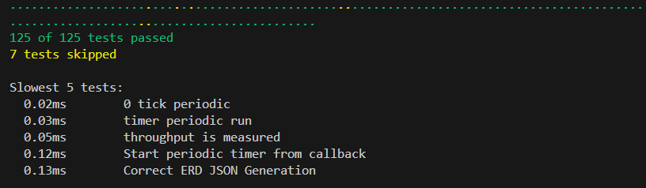
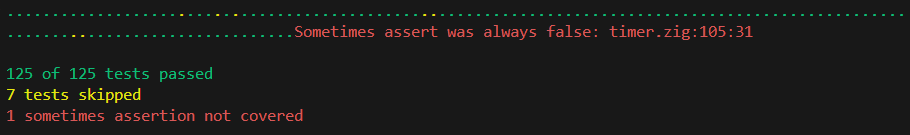

# Sometimes Assert

This is a custom test runner for Zig projects that allows for "sometimes assertions".
It is best thought of as a scalpel in the world of code coverage tools. Sometimes assertions
allow for expressing conditions that your tests must exercise in-line with your code. 

This is best used to check that your tests exercise edge-conditions, or otherwise subtle program states.
Usage is as easy as:

```zig
const sometimes = @import("sometimes");
sometimes.assert(&@src(), condition);
```

If `condition` fails to be either `true` or `false` across your test-suite, an error will be emitted.
It's recommended to write `condition` to be `true` in the "non-obvious" case.

## Instructions

Adding this to your project is as easy as `zig fetch --save git+https://github.com/Bud-ro/zig-sometimes-assert`

You need to ensure that `exe` builds use a disabled version of the module, and that test coverage builds
use an enabled version of the module:

```zig
const assert_sometimes_disabled = b.dependency("assert_sometimes", .{
    .target = target,
    .optimize = optimize,
    .enable_sometimes = false,
});
const sometimes_disabled_mod = assert_sometimes_disabled.module("sometimes");

const assert_sometimes_enabled = b.dependency("assert_sometimes", .{
    .target = target,
    .optimize = optimize,
    .enable_sometimes = true,
});
const sometimes_mod = assert_sometimes_enabled.module("sometimes");
```

Then simply add the import like so:
```zig
...
exe_mod.addImport("sometimes", sometimes_disabled_mod);

const test_coverage = b.addTest(.{
    .test_runner = .{
        .path = assert_sometimes_enabled.path("src/test_runner.zig"),
        .mode = .simple,
    },
    .root_module = b.createModule(.{
        .root_source_file = b.path("src/unit_tests.zig"),
        .target = target,
        .optimize = optimize,
    }),
});
test_coverage.root_module.addImport("sometimes", sometimes_mod);
```

It's recommended to add a `test_coverage` build in addition to the standard Zig test runner.
Sometimes assertions impose a heavier overhead than normal asserts due to the use of a hash table.
Additionally no support is given for fuzzing via `--fuzz`.

## Limitations
It's highly recommended that you use a code coverage tool to ensure that these statements are run at least once.
The implementation is extremely simple because there is no attempt made to scan for the location of every
sometimes assertion. That means sometimes assertions that fail to be `true` AND `false` are never found,
when logically this should be a test failure. There is no plan to fix this.

## Example Output





## Acknowledgement

This concept is highly inspired by the docs from Antithesis:
https://antithesis.com/docs/best_practices/sometimes_assertions/

My implementation obviously differs in that:
- It fails if `!condition` never occurs
- Sometimes assertions that are never run will fail to get "noticed"
- Sometimes assertions don't hook into the Zig fuzz system in a special way